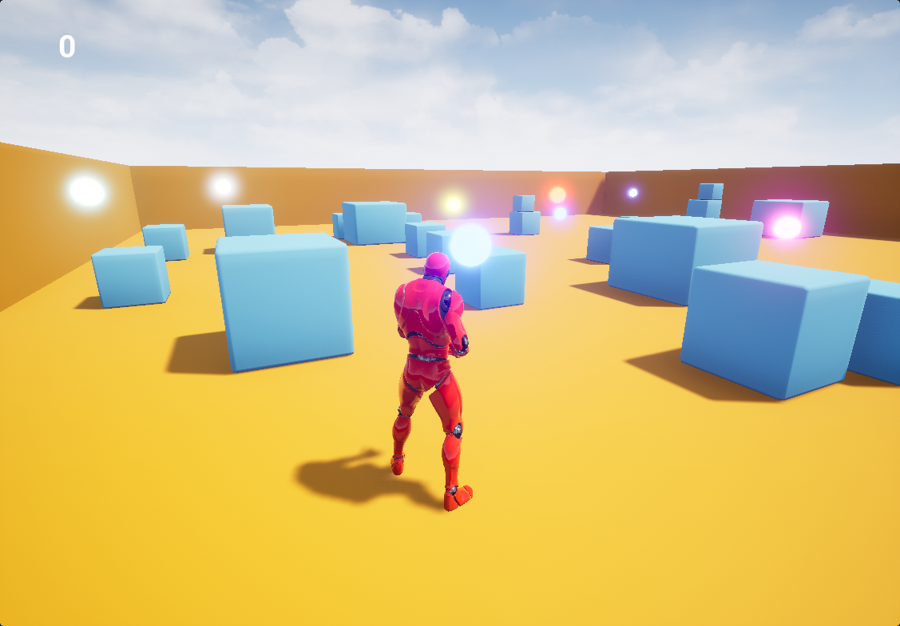

# ThirdPersonColors

Game prototype for my kids, developed from the Unreal Engine 4.19 C++ Third Person Template.

# TO-DO list (roughly prioritized)
## Priority
- Level design:
    - Parkour with various Obstacles & Walls
        - Bridges
        - Towers
        - Elevators
    - Multiple zones with various styles and challenges
        - Labyrinths
        - Caves
        - Heights/verticallity
    - Portals/teleportation
- Throw projectiles to switch objects' color
- Multiplayer
- Minimal menu (needed at least for multiplayer)

## More ideas
- Collect cube and assemble them
- Random spawn, with random colors
- Multiple levels
- Hat, backpack, and other accessories
- Various type of color pickups to change accessories colors?
- NPC AI's
- Animals or Children AI's
- Record children voices
- Some form of scoring
- Some form of achievements
- Game over?
- Write/tag letters on wall?

## Release
- 